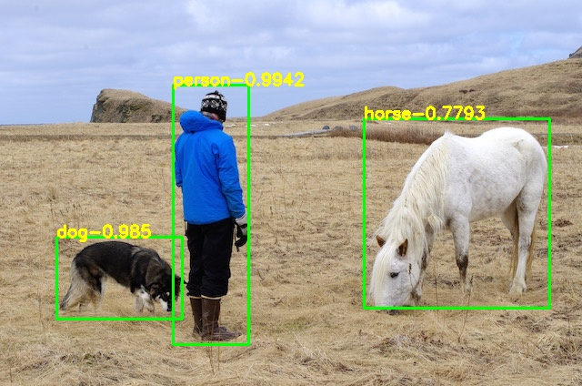
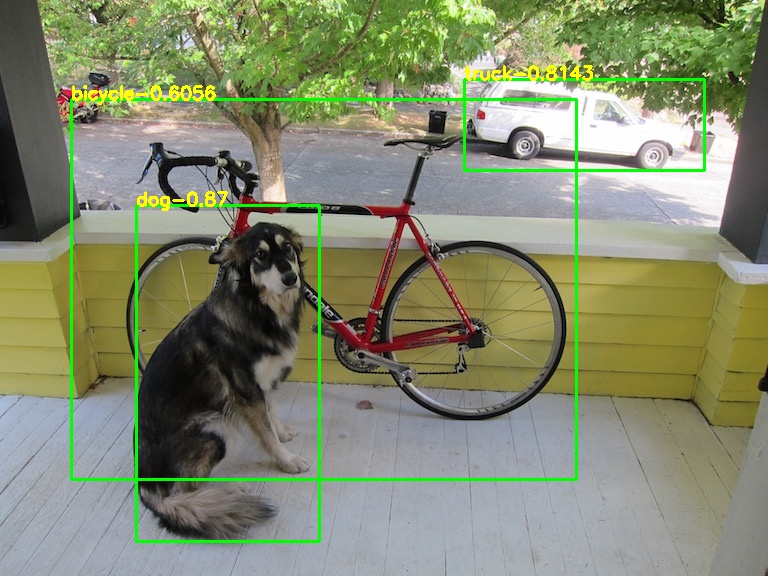
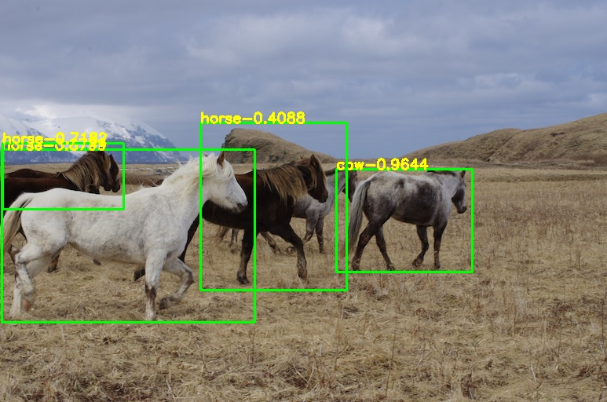
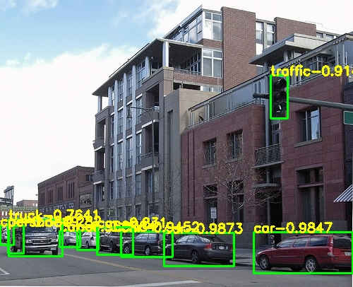

# YOLOV4_Tiny_PyTorch
yolov4-tiny to pytorch 

## Demo
     
   

## 中文解读
传送门

## Model
[yolov4-tiny.weights](https://github.com/AlexeyAB/darknet/releases/download/darknet_yolo_v4_pre/yolov4-tiny.weights)

## Reference
https://github.com/AlexeyAB/darknet  
https://blog.csdn.net/samylee  
